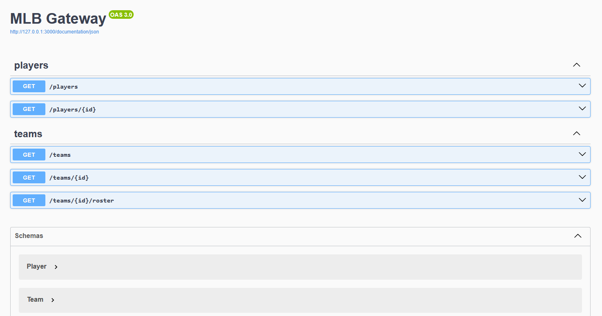

# MLB Microservices

A small microservice system demonstrating an API gateway that composes two
domain services: `player` and `team`. Built with Fastify and documented via
OpenAPI and diagrams-as-code.

## Overview

- **Gateway** (`gateway.js`, port 3000): Single entry point for clients. Proxies
  basic lists and composes cross-domain views like `GET /teams/:id/roster`.
- **Player service** (`services/player.js`, port 3001): Owns player data and
  exposes `GET /` and `GET /:id`.
- **Team service** (`services/team.js`, port 3002): Owns team data and exposes
  `GET /` and `GET /:id`.

## Diagrams

- Architecture: see [docs/architecture.md](./docs/architecture.md)
- API reference: see [docs/api.md](./docs/api.md)

## Install

Clone the repository:

```bash
git clone https://github.com/travishorn/mlb-microservices
```

Change into the directory:

```bash
cd mlb-microservices
```

Install the dependencies:

```bash
npm install
```

## Run locally

Open three terminals (or run in background):

```bash
# Terminal 1 – player service (port 3001)
node services/player.js

# Terminal 2 – team service (port 3002)
node services/team.js

# Terminal 3 – gateway (port 3000)
node gateway.js
```

## API Docs (OpenAPI)

Each service and the gateway host Swagger UI:

- Gateway: http://localhost:3000/documentation
- Player: http://localhost:3001/documentation
- Team: http://localhost:3002/documentation

Preview:



## Example requests

```bash
# All players (via gateway)
curl http://localhost:3000/players

# All players (via players microservice)
curl http://localhost:3001/

# All teams
curl http://localhost:3000/teams

# Single player
curl http://localhost:3000/players/1

# Single team
curl http://localhost:3000/teams/1

# Roster composed by gateway
curl http://localhost:3000/teams/1/roster
```

## License

The MIT License

Copyright 2025 Travis Horn

Permission is hereby granted, free of charge, to any person obtaining a copy of
this software and associated documentation files (the “Software”), to deal in
the Software without restriction, including without limitation the rights to
use, copy, modify, merge, publish, distribute, sublicense, and/or sell copies of
the Software, and to permit persons to whom the Software is furnished to do so,
subject to the following conditions:

The above copyright notice and this permission notice shall be included in all
copies or substantial portions of the Software.

THE SOFTWARE IS PROVIDED “AS IS”, WITHOUT WARRANTY OF ANY KIND, EXPRESS OR
IMPLIED, INCLUDING BUT NOT LIMITED TO THE WARRANTIES OF MERCHANTABILITY, FITNESS
FOR A PARTICULAR PURPOSE AND NONINFRINGEMENT. IN NO EVENT SHALL THE AUTHORS OR
COPYRIGHT HOLDERS BE LIABLE FOR ANY CLAIM, DAMAGES OR OTHER LIABILITY, WHETHER
IN AN ACTION OF CONTRACT, TORT OR OTHERWISE, ARISING FROM, OUT OF OR IN
CONNECTION WITH THE SOFTWARE OR THE USE OR OTHER DEALINGS IN THE SOFTWARE.
