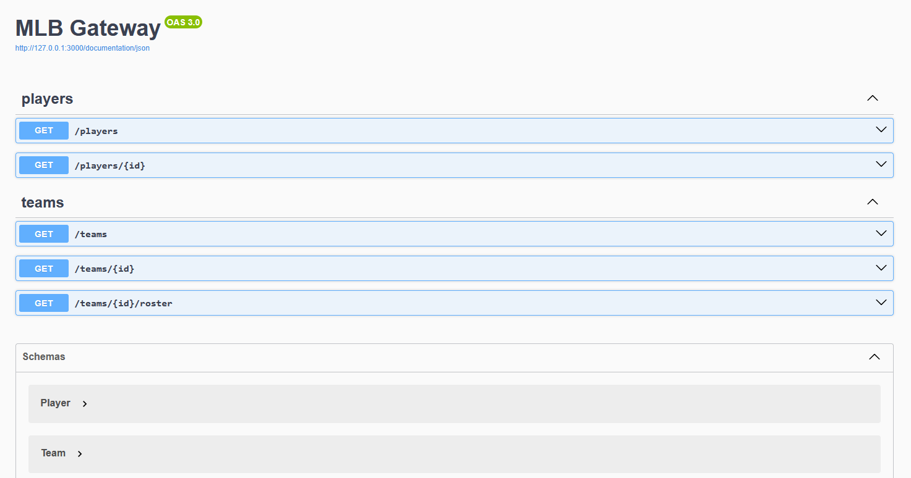

# API Reference

This document summarizes the HTTP endpoints exposed by the gateway and domain
services. Each process also serves Swagger UI with OpenAPI generated from the
code.

- Gateway Swagger UI: http://localhost:3000/documentation
- Player Swagger UI: http://localhost:3001/documentation
- Team Swagger UI: http://localhost:3002/documentation

Preview:



## Schemas

```json
Player {
  id: integer,
  teamId: integer,
  name: string,
  position: string
}

Team {
  id: integer,
  name: string,
  division: string
}

Error {
  error: string
}
```

## Gateway (port 3000)

### GET /players

- **Description**: Get all players (proxy to player service)
- **Response**: `200` `[Player]`

```bash
curl http://localhost:3000/players
```

### GET /players/:id

- **Description**: Get a player by ID (proxy to player service)
- **Params**:
  - **id**: integer (path)
- **Responses**:
  - `200` `Player`
  - `404` `Error`

```bash
curl http://localhost:3000/players/1
```

### GET /teams

- **Description**: Get all teams (proxy to team service)
- **Response**: `200` `[Team]`

```bash
curl http://localhost:3000/teams
```

### GET /teams/:id

- **Description**: Get a team by ID (proxy to team service)
- **Params**:
  - **id**: integer (path)
- **Responses**:
  - `200` `Team`
  - `404` `Error`

```bash
curl http://localhost:3000/teams/1
```

### GET /teams/:id/roster

- **Description**: Get team details plus roster (composed by gateway)
- **Params**:
  - **id**: integer (path)
- **Responses**:
  - `200` `Roster { team: Team, roster: [Player] }`
  - `404` `Error`

```bash
curl http://localhost:3000/teams/1/roster
```

## Player service (port 3001)

### GET /

- **Description**: Get all players
- **Response**: `200` `[Player]`

### GET /:id

- **Description**: Get a player by ID
- **Params**:
  - **id**: integer (path)
- **Responses**:
  - `200` `Player`
  - `404` `Error`

## Team service (port 3002)

### GET /

- **Description**: Get all teams
- **Response**: `200` `[Team]`

### GET /:id

- **Description**: Get a team by ID
- **Params**:
  - **id**: integer (path)
- **Responses**:
  - `200` `Team`
  - `404` `Error`
