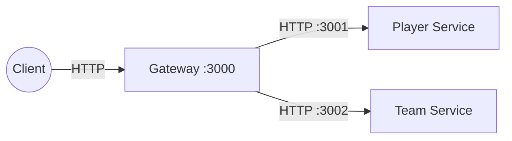
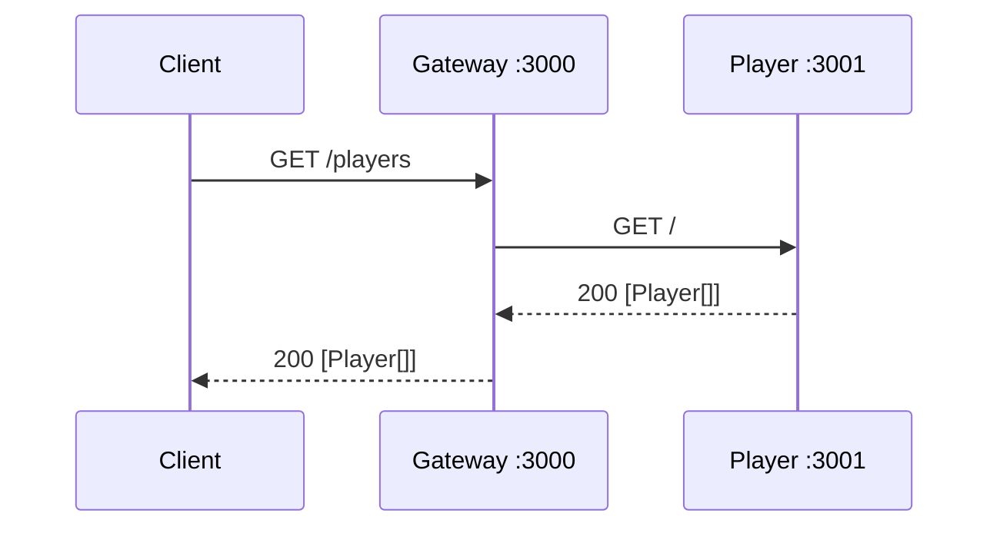
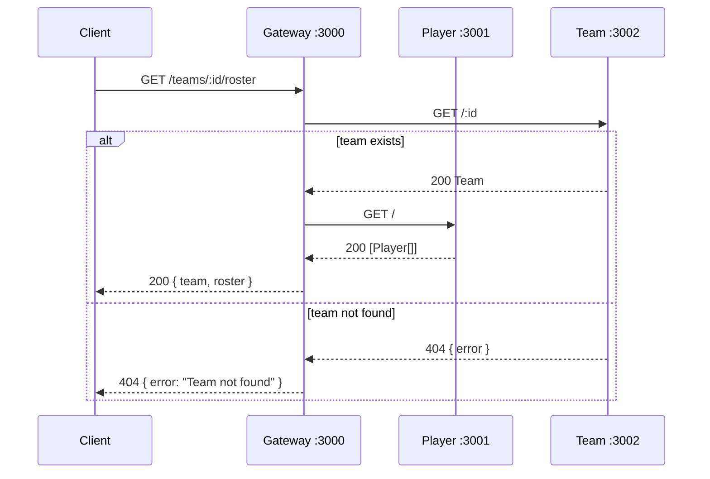

# Architecture

This system is a small microservices setup with an API Gateway that composes
data from domain services.

## System context

`gateway.js` exposes client-facing endpoints and composes cross-domain
responses. `services/player.js` owns and serves player data. `services/team.js`
owns and serves team data.

## Sequence: GET /players

## Sequence: GET /teams/:id/roster

## Notes

- Gateway preserves downstream errors for simple proxy routes.
- Composition lives in the gateway to keep domain services simple and
  scalable.
